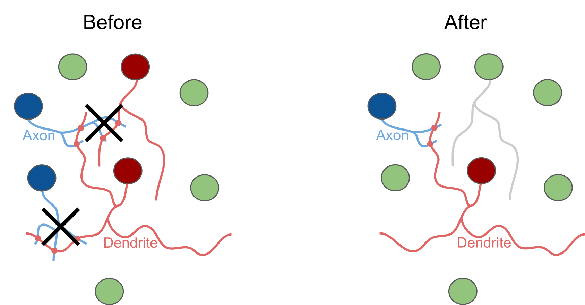
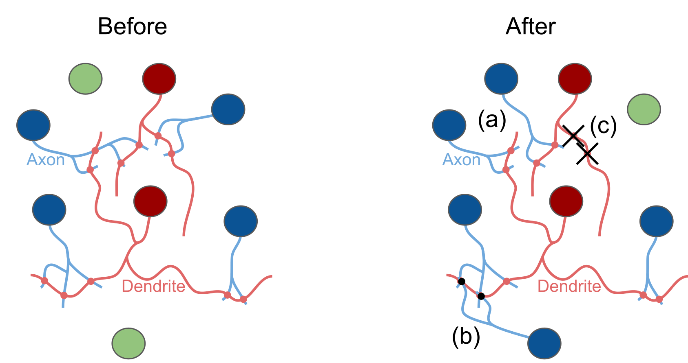
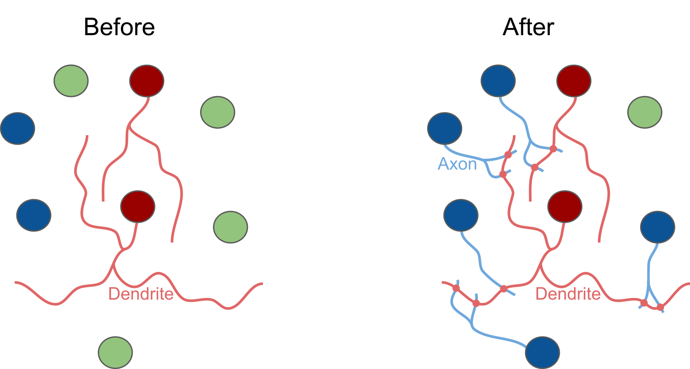
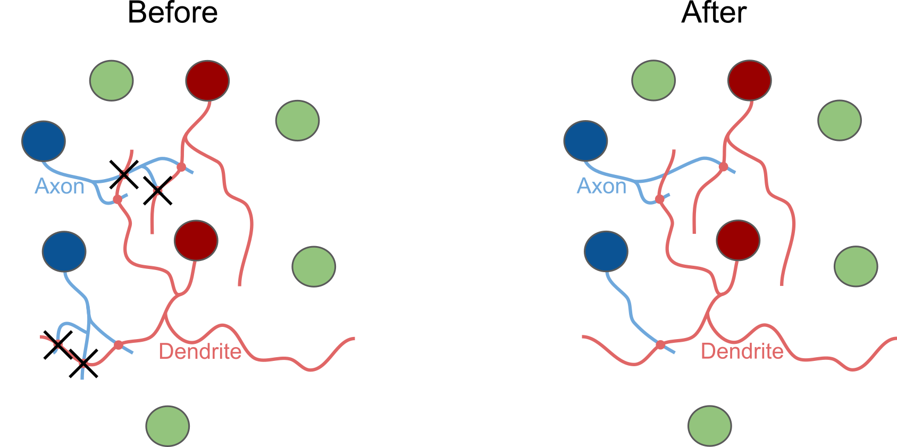

# Manipulations overview

Manipulation operations that can be applied to a connectome. The circuit neurons (nodes) are always unchanged!

| File | Description | Example |
| :-- | :-- | :-- |
| __[/null_manipulation.py](manipulation/null_manipulation.py)__ | __Null manipulation__   This is just a dummy manipulation function performing no manipulation at all. This function is intended as a control condition to run the manipulation pipeline without actually manipulating the connectome. |  |
| __[/conn_extraction.py](manipulation/conn_extraction.py)__ | __Connection extraction__   Extracts the connectome of a given cell target (i.e., a named group of neurons, a.k.a. node set), keeping only connections among these target cells. Cell targets intrinsic to a circuit or provided through an external SONATA node sets file containing lists of GIDs (.json) are supported. If no cell target is specified, an empty connectome file is returned. The nodes (cell) table is always kept unchanged. |  |
| __[/conn_removal.py](manipulation/conn_removal.py)__ | __Connection removal__   Removes a certain percentage of randomly selected connections (i.e., all synapses belonging to a connection) between selected groups of neurons (layers, m-types, ...), optionally removing only connections within a certain range of #synapses/connection and/or within a connection mask (sparse adjacency matrix). |  |
| __[/conn_rewiring.py](manipulation/conn_rewiring.py)__ | __Connection rewiring__   Wiring or rewiring of connections between pairs of neurons based on a given connection probability model (which canoptionally be scaled by a global probability scaling factor to fine-tune the resulting number of connections). Existing connections can be preserved, or reused in new connections (as in (a)). Otherwise, existing synapses (and connections) may be deleted (as in (c)) or new ones created by either reusing existing positions (as in (b)), randomly generating new positions on the post-synaptic dendrites, or loading exising positions externally. Physiological synapse properties can be sampled from existing synapses or drawn from model distributions. Numbers of synapses per connection can be sampled from existing connections, drawn from model distributions, or provided by a synaptome matrix.   Optionally: Preserving indegrees, only adding connections, only deleting connections. |  |
| | Algorithm: For each post-synaptic target neuron...      | |
| __[/conn_wiring.py](manipulation/conn_wiring.py)__ | __Connectome wiring__   Special case of connectome rewiring, which wires an empty connectome from scratch, or simply adds connections to an existing connectome, based on given connection probability models for each pathway.    ℹ️ This is a highly optimized operation for wiring huge connectomes by pathways (i.e., for each pair of pre-/post-synaptic hemisphere/region/m-type). However, only specific properties like source/target node, afferent synapse positions, synapse type (INH: 0, EXC: 100), and delay (optional) will be generated. For general purpose wiring, please use the "Connectome rewiring" operation! |  |
| __[/syn_removal.py](manipulation/syn_removal.py)__ | __Synapse removal__   Removes a certain percentage of synapses between selected groups of neurons (layers, m-types, ...), resulting in (a) reduced #synapses/connection or (b) removed connections (i.e., all synapses of a connection removed). |  |
|                     | Optionally:   Keeping connections (i.e., at least 1 synapse/connection kept). |  |
|                     | Optionally:   Re-scaling conductances G* of remaining synapses to keep sum of conductances per connection constant (unless whole connection is removed). |  |
| __[/syn_subsampling.py](manipulation/syn_subsampling.py)__ | __Synapse subsampling__   Random subsampling of synapses, keeping a certain percentage of randomly selected synapses. This is a special case of "Synapse removal", which is more efficient but does not have any selection options supported. | |
| __[/syn_prop_alteration.py](manipulation/syn_prop_alteration.py)__ | __Synapse property alteration__   Alters values of certain synapse properties (e.g., conductance, delay, ...) of a certain percentage of synapses between selected groups of neurons (layers, m-types, ...) by setting them to a new absolute value, relative scaling, offsetting, randomizing, ...   It can also be used to (carefully!) manipulate synapse locations on the dendrite.   Example: Afferent section pos/ID set to 0 (= soma) |  |

Copyright (c) 2024 Blue Brain Project/EPFL